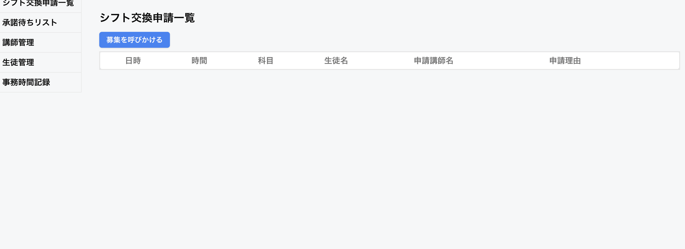

URL ( https://attendance-management-rouge.vercel.app/ )

## 使用技術

* TypeScript(Next)
* drizzleORM
* supabase
* slack API
  
## 使用準備
---
* slackアカウント（できれば二つあると確認しやすい）
  複数のメールアドレスを作成する際には下記を参考にしてみてください
  
## 導入手順
---
* slack側で下記の招待からワークスペースに入ってください
  （https://join.slack.com/t/w1740385716-adu148397/shared_invite/zt-32lz6pgw7-3YUyLyTK6yguvuLy284~Dg）

* web上で講師として登録してください(/admin/teacher/create)
  この時にメールアドレスはslackアカウントのメールアドレスと同じで登録してください

* web上でシフトを登録してください
講師一覧から名前をクリックすると作成できます（複数作成しておいた方が良いです）

上記で初期設定は完了です

## 機能概要
---

### シフト交換機能

***シフト交換のワークフロー***
* slackの勤怠管理ワーク上で/コマンド(/シフト交換)を打ってください
* 先ほど登録したシフトを選択して交換申請に出してください
* 　管理画面のシフト交換申請一覧を開くと先ほど交換申請に出したシフトが出てきます

* 募集を呼びかけるでslack上にslack上にメッセージを送信する事ができます

### 事務管理の自動抽出
* "teacher/attendace"に行ってください
*  退勤の際に出勤から退勤までの時間内でシフト外の時間は事務時間として検出されます

