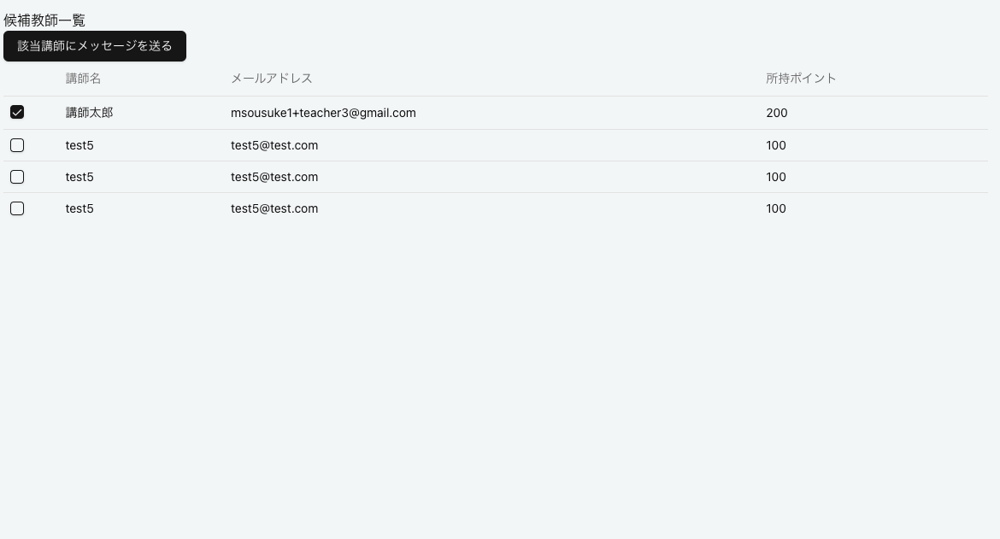

URL ( https://attendance-management-rouge.vercel.app/ )

管理者画面: https://attendance-management-rouge.vercel.app/
出勤・退勤画面: https://attendance-management-rouge.vercel.app/teacher/attemdance

## 使用技術

* TypeScript(Next)
* drizzleORM
* supabase
* slack API
  
## 使用準備

---講師登録（slack, web）
* slackアカウント（できれば二つアカウントあると確認しやすい）
  複数のメールアドレスを作成する際には下記を参考にしてみてください
  https://mailwise.cybozu.co.jp/column/114.html
  
## 導入手順
1. slack側で下記の招待からワークスペースに入ってください
  （https://join.slack.com/t/w1740385716-adu148397/shared_invite/zt-32lz6pgw7-3YUyLyTK6yguvuLy284~Dg）

* web上で講師として登録してください(/admin/teacher/create)
  この時にメールアドレスはslackアカウントのメールアドレスと同じで登録してください

  ***講師管理画面のシフトの新規作成からも行う事ができます***
  

2. web上でシフトを登録してください
講師一覧から名前をクリックすると作成できます（複数シフト作成しておいた方が確認しやすいです）

上記で初期設定は完了です

## 機能概要
---

### シフト交換機能

***シフト交換のワークフロー***

***シフト交換依頼までの流れ***
1. ***slackの勤怠管理ワークチャンネル上›で/コマンド(/シフト交換)を打ってください***
* 
2. ***先ほど登録したシフトを選択して交換申請に出してください***
   
   

3. ***管理画面のシフト交換申請一覧を開くと先ほど交換申請に出したシフトが出てきます***

4. 特定のシフトをチェックして募集を呼びかけるでslack上にメッセージを送信する事ができます
   

5. また候補講師を探すをクリックするとシフトの科目とコマ時間から空いている講師を抽出、表示されボットを介したDMメッセージを送信する事ができます

***シフト代理の流れ***
1. 二つアカウントが用意できていれば、もう一方のアカウントでslack上で募集されているシフトの詳細を見るから交換する事ができます。*同一アカウントでのシフト交換は行えないようになっています

***交換の管理者承認・拒否***

1. オーナー画面の承諾待ちに行ってもらうと、代打が決まったシフトが一覧で表示されます

2. ここからシフト交換の承認・拒否を行う事ができます

### 事務管理の自動抽出
1. "teacher/attendace"に行ってください
2. 退勤を押した際にシフト外の時間は事務時間として検出され、事務時間入力をする画面屁と遷移します

3. 事務記録はadmin/workRecordsで確認する事ができます。（講師名をクリックすると講師の事務時間を確認できます）
4. 月毎の事務時間をcsvダウンロードする事ができます

